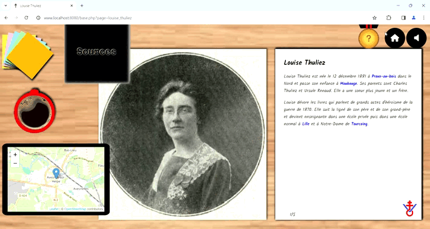
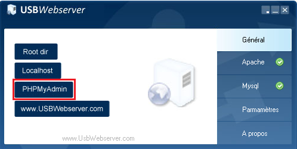
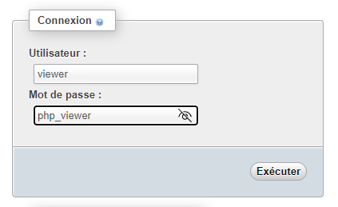
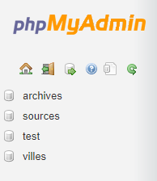
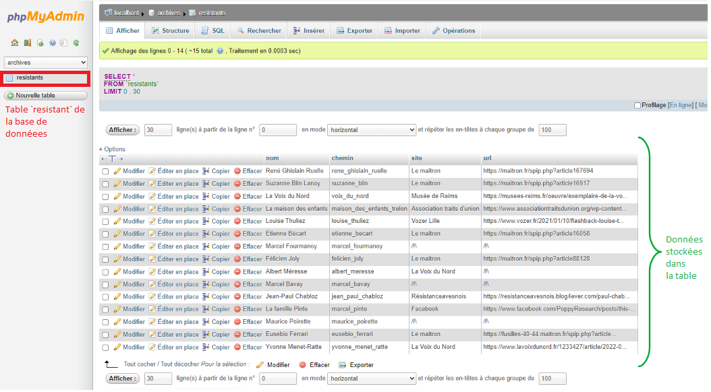

[](https://www.php.net/)
[](https://developer.mozilla.org/fr/docs/Web/HTML)
[](https://developer.mozilla.org/fr/docs/Web/CSS)
[](https://developer.mozilla.org/fr/docs/JavaScript)
[](https://www.usbwebserver.net/webserver/)
[](https://www.usbwebserver.net/webserver/)

## Fonctionnement du site

Le site fonctionne grâce à plusieurs langages. La partie `frontend`, c'est-à-dire la partie qui s'exécute dans le navigateur du client, utilise :

- **HTML** pour la structure (titre, texte, image, ...)
- **CSS** pour le style (mise en page, couleurs, diposition, animations ...)
- **JavaScript** pour les actions dynamiques (actions au clique, dynamisation des animations, ...)

Pour les actions côté serveur, ou en `backend`, le site fonctionne avec:

- **PHP** pour la génération de balises dynamiquement et la lecture de base de données
- **MySQL** pour  les bases de données

Ces technologies sont installées sur la clé USB grâce à **USBWebServer**. Le site est alors accessible sur tous les appareils Windows même si les dépendances nécessaires n'y sont pas installées.


Le site est composé d'une page principale `index.php` qui redirige vers une page spécifique à chaque résistant. Ces pages ont toutes une structures communes contenant les bases HTML, les liens vers les styles CSS, les scripts et les dépendances en ligne, qui est regroupée dans le fichier `base.php` à la racine du répertoire.
Lorsque vous êtes redirigé, la structure commune est chargée.

La fonction `lire_base_de_donnees` du fichier `fichiers_externes\lecture.php` est alors appelée et permet de transmettre la page séléctionnée puis de récupérer les informations qui lui sont associées.
Plusieurs autres fonctions PHP et JavaScript peuvent alors s'exécuter et ajouter dynamiquement le contenu spécifique. Enfin, la page est stylisée grâce aux fichiers CSS qui gèrent la disposition et l'apparence des éléments ainsi que les animations, même si celles-ci s'exécutent avec des gestionnaires d'évènements JavaScript.

Ce fonctionnement permet d'écrire des fichiers en HTML simples et facilement lisibles et modifiables pour les pages individuelles. Le contenu est donc organisé en sections, chaque section correspondant à un thème.

> ```html
<section>
    <h1>Nom de section</h1>
    <p>Description et explications</p>
    
</section>
```

Elles seront ensuite dynamisées par JavaScript, ce qui veut dire que du contenu perosnnalisé est ajouté sans avoir à recréer un fichier. Une icône de *V de la victoire avec une croix de lorraine* est donc ajouté en bas à droite de chaque page et permet de tourner la page lorque vous cliquez dessus.


## Lancement du site

1. **Exécutez le fichier** `serveur.bat` en cliquant deux fois dessus.

1. **Accéder au site :**
Le site devrait s'ouvrir automatiquement dans votre navigateur. Si cela ne se produit pas, vous pouvez essayer les étapes suivantes :
	2. Accédez manuellement à [index.php](http://www.localhost:8080/index.php).
	2. Si des erreurs persistent, exécutez le fichier comme administrateur (clic droit > Exécuter en tant qu'administrateur).
	2. Si le serveur ne se lance toujours pas, exécutez `diagnostique.exe`.
1. Pour naviguer dans le site, cliquez ur une photo pour lire ou survoler un dossier pour prévisualiser la page.


## Fonctionnalités

Si vous avez besoin d'aide sur le site, cliquez simplement sur le point d'interrogation en haut à gauche pour afficher les fonctionnalitée du site.

<style>
	td {
		width: 33%;
		text-align: center;
		padding: 5px;
	}
</style>
<table>
    <tr>
        <th>Afficher l'aide</th>
        <th>Afficher les sources</th>
        <th>Rechercher une ville</th>
    </tr>
    <tr>
        <td>
		
	</td>
        <td>
		
	</td>
        <td>
		
	</td>
    </tr>
    <tr>
        <td>
		Si vous avez besoin d'aide sur le site,
		cliquez simplement sur le point d'interrogation pour afficher l'aide.
	</td>
        <td>
		<kbd>Double-cliquez</kbd>
		sur le bloc-note ou appuyer sur la touche
		<kbd>espace</kbd> pour afficher les sources
	</td>
        <td>
		Les villes sont indiquées en
		<button style="color: blue;">bleu</button>
		dans le texte. Cliquez dessus pour afficher dans la tablette en bas à droite.
	</td>
    </tr>
</table>

## Sources

Pour nos recherches, nous avons utilisé de nombreux sites. Voici quelques exemples:

- Voix du nord
- vozer.fr
- Le maitron
- resistancepasdecalais
- wikiwand
- wikimonde
- wikipedia
- enfait
- Association traits d'union
- Mémoire 14-45
- Avesnois tourisme


## Bases de données

3. Pour accéder aux bases de données, cliquez sur le bouton `PHPMyAdmin` dans l'onglet `Généralité` de la fenêtre USBWebServer.

	

3. Ensuite connectez vous:

	*Utilisateur* : viewer
	*Mot de passe* : php_viewer
	

3. Dans le volet à gauche, sélectionnez la base de données qui vous intéresse.

	

3. Dans chaque base de données, vous trouverez des tables, c'est-à-dire des tableaux qui stockent les donnéees.

	

<table>
	<tbody>
		<tr>
			<td>Base de données</td>
			<td>Table</td>
			<td>Description</td>
		</tr>
		<tr>
			<td>archives</td>
			<td>resistants</td>
			<td>Cette table contient les noms des résistants présents sur le site.</td>
		</tr>
		<tr>
			<td rowspan="4">sources</td>
			<td>René Ghislain Ruelle</td>
			<td rowspan="4">Dans cette base de données, chaque table porte le nom d'un résistant présenté sur le site et chaque ligne contient une source que nous avons</td>
		</tr>
		<tr>
			<td>Suzanne Blin Lanoy</td>
		</tr>
		<tr>
			<td>La Voix du Nord</td>
		</tr>
		<tr>
			<td>...</td>
		</tr>
		<tr>
			<td>villes</td>
			<td>villes</td>
			<td>La table regroupe toutes les villes dont nous parlons sur le site.</td>
		</tr>
	</tbody>
</table>
